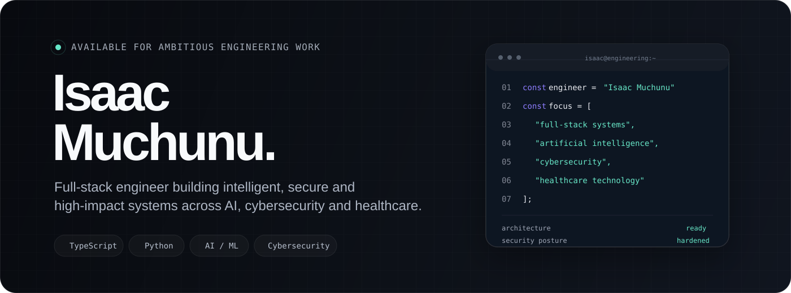
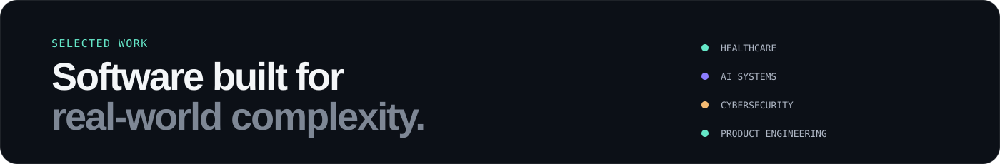

<p align="center">
  
</p>

<p align="center">
  <a href="https://github.com/isaacmuchunu">
    
  </a>
  &nbsp;
  <a href="https://linkedin.com/in/isaac-muchunu-87995211b">
    
  </a>
  &nbsp;
  <a href="mailto:isaacmuchunu@gmail.com">
    
  </a>
</p>

<br>

<table>
<tr>
<td width="58%" valign="top">

## I build systems, not just features.

I'm a full-stack engineer working across **software architecture, AI, cybersecurity, healthcare technology, and infrastructure**.

I care about the whole system: how it feels to use, how data moves, how services communicate, where trust boundaries sit, what happens when things fail, and how the product behaves in production.

My best work sits at the intersection of **useful software + strong engineering + real-world impact**.

</td>
<td width="42%" valign="top">

### Engineering snapshot

|  |  |
|---|---:|
| Public repositories | **40+** |
| Projects shipped | **12+** |
| Years building | **5+** |
| Core disciplines | **4** |

</td>
</tr>
</table>

<br>

## 01 / Expertise

<table>
<tr>
<td width="50%" valign="top">

### Full-stack systems

Production applications from interface to infrastructure.

`TypeScript` `Python` `PHP`  
`Vue` `React` `Next.js`  
`PostgreSQL` `MongoDB` `REST APIs`

</td>
<td width="50%" valign="top">

### AI & intelligent systems

Turning models into usable products, workflows, and agents.

`Machine Learning` `LLMs`  
`AI Agents` `Automation`  
`Data Pipelines` `Python`

</td>
</tr>
<tr>
<td width="50%" valign="top">

### Cybersecurity engineering

Designing and testing systems from both defensive and offensive perspectives.

`Purple Team Labs` `SIEM`  
`Active Directory` `Detection`  
`DevSecOps` `Penetration Testing`

</td>
<td width="50%" valign="top">

### Cloud & delivery

Reliable environments, repeatable delivery, and production-minded engineering.

`Docker` `AWS` `Linux`  
`GitHub Actions` `CI/CD`  
`Observability`

</td>
</tr>
</table>

<br>

<p align="center">
  
</p>

<br>

<table>
<tr>
<td width="50%" valign="top">

### 001 · [MediConnect](https://github.com/isaacmuchunu/mediconnect)

**Healthcare · Python · Real-time systems**

Production-ready ambulance dispatch and healthcare coordination platform combining emergency workflows, provider networks, real-time operations, and intelligent automation.

**What it demonstrates**

`systems thinking` `workflow design` `healthcare tech` `backend engineering`

</td>
<td width="50%" valign="top">

### 002 · [SaferNET](https://github.com/isaacmuchunu/SaferNET)

**EdTech · PHP · Web Filtering**

K-12 school web filtering application providing content management, access control, and security monitoring for educational institutions.

**What it demonstrates**

`security controls` `access management` `enterprise systems` `product engineering`

</td>
</tr>

<tr>
<td width="50%" valign="top">

### 003 · [SafeNET](https://github.com/isaacmuchunu/SafeNET)

**TypeScript · Network Security**

Network monitoring and security orchestration platform with real-time threat detection and automated response capabilities.

**What it demonstrates**

`cybersecurity systems` `real-time processing` `threat detection` `infrastructure automation`

</td>
<td width="50%" valign="top">

### 004 · [AgriBio](https://github.com/isaacmuchunu/AgriBio-website)

**TypeScript · Product Engineering**

Modern agricultural biotechnology platform focused on responsive design, component architecture, and polished web experiences.

**What it demonstrates**

`frontend systems` `UI engineering` `responsive design` `product thinking`

</td>
</tr>

<tr>
<td width="50%" valign="top">

### 005 · [SCFMS](https://github.com/isaacmuchunu/SCFMS)

**C# · Enterprise Systems**

Sub-County File Management System for Kikuyu Sub-County Education Office - structured workflows, approvals, records, and reporting for government operations.

**What it demonstrates**

`enterprise architecture` `government systems` `workflow automation` `data management`

</td>
<td width="50%" valign="top">

### 006 · [public-participate](https://github.com/isaacmuchunu/public-participate)

**Vue · Civic Tech**

Kenyan Public Participation Platform for the National Assembly & Senate enabling citizen engagement in legislative processes.

**What it demonstrates**

`civic technology` `public sector systems` `Vue frontend` `democratic engagement`

</td>
</tr>
</table>

<br>

## 03 / How I build

<table>
<tr>
<td width="33%" valign="top">

### 01
## Think in systems.

Understand users, data, dependencies, failure modes and operational constraints before reaching for a framework.

</td>
<td width="33%" valign="top">

### 02
## Security by design.

Authentication, permissions, observability and resilience belong in the architecture from the beginning.

</td>
<td width="33%" valign="top">

### 03
## Ship useful things.

Technical sophistication matters most when it improves a real workflow or creates measurable value.

</td>
</tr>
</table>

<br>

## 04 / Toolkit

<table>
<tr>
<td><strong>Languages</strong></td>
<td><code>TypeScript</code> <code>Python</code> <code>JavaScript</code> <code>PHP</code> <code>C#</code> <code>SQL</code></td>
</tr>
<tr>
<td><strong>Frontend</strong></td>
<td><code>Vue</code> <code>React</code> <code>Next.js</code> <code>Modern CSS</code> <code>Design Systems</code></td>
</tr>
<tr>
<td><strong>Backend</strong></td>
<td><code>Node.js</code> <code>Python Services</code> <code>REST APIs</code> <code>PostgreSQL</code> <code>MongoDB</code></td>
</tr>
<tr>
<td><strong>AI</strong></td>
<td><code>Machine Learning</code> <code>LLMs</code> <code>AI Agents</code> <code>Automation</code> <code>Data Pipelines</code></td>
</tr>
<tr>
<td><strong>Security</strong></td>
<td><code>Purple Team Labs</code> <code>Wazuh SIEM</code> <code>Suricata IDS</code> <code>Active Directory</code> <code>DevSecOps</code></td>
</tr>
<tr>
<td><strong>Infrastructure</strong></td>
<td><code>Docker</code> <code>AWS</code> <code>Linux</code> <code>CI/CD</code> <code>GitHub Actions</code></td>
</tr>
</table>

<br>

## 05 / GitHub activity

<p align="center">
  
  
</p>

<p align="center">
  
</p>

<br>

## 06 / What I care about

**Healthcare technology**  
Software that improves coordination, access, operations, and decision-making where the stakes are real.

**Artificial intelligence**  
AI systems that move beyond demos and become useful, orchestrated, measurable parts of actual products.

**Cybersecurity**  
Security as an architectural property: identity, trust boundaries, monitoring, resilience, and disciplined engineering.

**Public-sector & enterprise systems**  
Structured workflows, approvals, records, reporting, automation, and systems that survive real organizational complexity.

<br>

```text
architecture        ready
security posture    hardened
AI systems          online
delivery pipeline   active
curiosity           permanent
```

<br>

<div align="center">

## Have an ambitious problem?

### Let's build something worth shipping.

I'm interested in challenging work involving **full-stack engineering, AI, healthcare technology, cybersecurity, automation, and secure enterprise systems**.

<br>

<a href="mailto:isaacmuchunu@gmail.com">
  
</a>

<br><br>

[GitHub](https://github.com/isaacmuchunu) · [LinkedIn](https://linkedin.com/in/isaac-muchunu-87995211b)

<br>

<sub>Isaac Muchunu · Nairobi, Kenya · 2026</sub>

</div>
